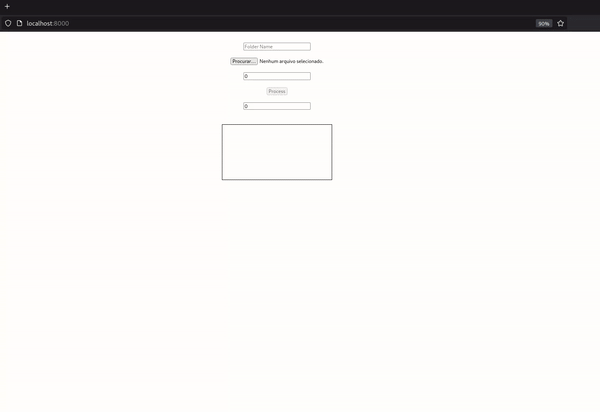

# Converte paginas do PDF para imagens

Cria uma pasta e dentro dela grava uma imagem para cada pagina do arquivo PDF.

A variavel scale define a escala da imagem gerada.

## Dependencias

- [X] Javascript
- [X] pdf.js

